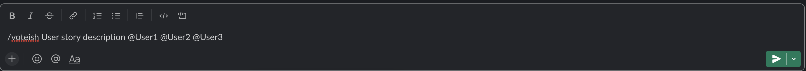
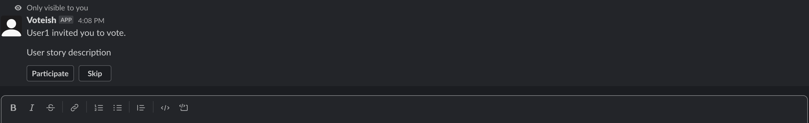
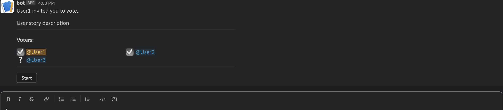
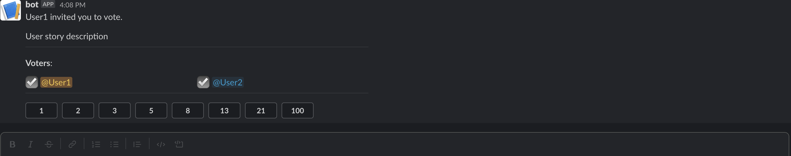
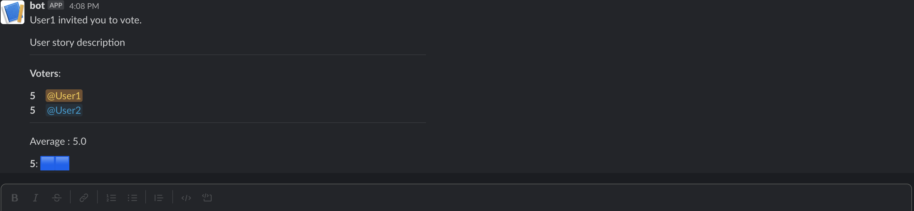

# voteish

## How it works
### Step 1
Create a new voting session by typing the command `/voteish` followed by the description of the topic and at the end the participants (slack mentions), including yourself

### Step 2
An invitation message will be sent to all mentioned users (including you). Users must opt to participate or skip the voting session.

### Step 3
Once a user has joined he will see the list of mentioned users and their status:
-  - User is participating
-  - User has not yet opted to participate or skip

The creator of the session will also have a button to Start the voting, when all people have joined. If start button has been pressed, the user that did not opt to participate/skip will automatically be marked as skipped.

### Step 4
Once the session has started, the story points options are shown and users can vote. 
When an user has voted, the icon becomes green (  )

### Step 5
Once every participating user has voted, the voting session is closed and results are displayed:
- every user vote
- average store points
- number of votes per story point

